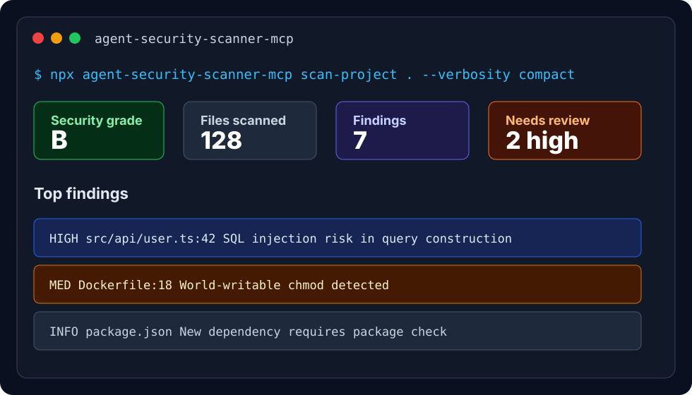
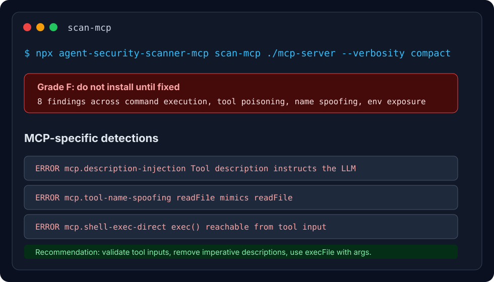
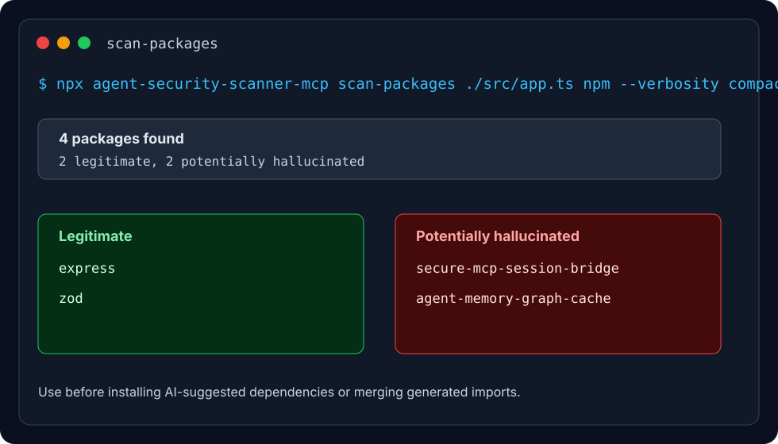

<div align="center">


# agent-security-scanner-mcp

**Security scanner for AI coding agents, MCP servers, prompts, and AI-suggested packages.**

Run it before Claude Code, Cursor, Windsurf, Cline, OpenCode, or another agent trusts new code, tools, prompts, or dependencies.

[](https://www.npmjs.com/package/agent-security-scanner-mcp)
[](https://www.npmjs.com/package/agent-security-scanner-mcp)
[](LICENSE)
[](https://github.com/sinewaveai/agent-security-scanner-mcp/actions/workflows/test.yml)

</div>

## Copy-Paste Start

Scan any repo and get an A-F agent security grade:

```bash
npx agent-security-scanner-mcp scan-project . --verbosity compact
```

Install the scanner into your AI coding client:

```bash
npx agent-security-scanner-mcp init claude-code
```

Replace `claude-code` with `cursor`, `claude-desktop`, `windsurf`, `cline`, `kilo-code`, `opencode`, or `cody`.

Audit an MCP server before adding it to an agent:

```bash
npx agent-security-scanner-mcp scan-mcp ./path/to/mcp-server --verbosity compact
```

Check AI-generated imports for package hallucinations:

```bash
npx agent-security-scanner-mcp scan-packages ./src/app.ts npm --verbosity compact
```

## What It Catches

| Risk | Why agents need it | Command |
| --- | --- | --- |
| Vulnerable generated code | Agents can introduce SQL injection, XSS, command injection, unsafe crypto, and secrets | `scan-project`, `scan-security`, `scan-diff` |
| MCP server attacks | MCP tools can poison descriptions, spoof names, exfiltrate env vars, or execute commands | `scan-mcp` |
| Prompt injection | Agents often process untrusted docs, tickets, pages, and tool output | `scan-prompt` |
| Unsafe agent actions | Catch dangerous shell/file/network actions before execution | `scan-action` |
| Hallucinated packages | AI often invents dependency names that attackers can later squat | `check-package`, `scan-packages` |
| SBOM and CVEs | Generate CycloneDX SBOMs and scan dependencies with OSV.dev | `sbom-generate`, `sbom-vulnerabilities` |
| Semantic review | LLM-powered review that uses project intent to find context-aware issues | `cr-agent` |

## Screenshots

### Project Scan



### MCP Server Audit



### Package Hallucination Detection



## Demos

Run a safe local demo that creates intentionally vulnerable fixtures, scans them, and cleans them up.

```bash
# MCP audit demo: tool poisoning, spoofed tool name, command execution, secret exposure
npx agent-security-scanner-mcp demo --type mcp --no-prompt

# Package hallucination demo: real imports mixed with fake AI-generated package names
npx agent-security-scanner-mcp demo --type packages --no-prompt
```

Expected demo shape:

```json
{
  "grade": "F",
  "findings_count": 8,
  "findings": [
    {
      "rule": "mcp.description-injection",
      "severity": "ERROR",
      "message": "Tool description contains imperative language directed at the LLM."
    },
    {
      "rule": "mcp.tool-name-spoofing",
      "severity": "ERROR",
      "message": "Tool name is close to a well-known MCP tool name."
    }
  ]
}
```

## Install In Your Agent

```bash
npx agent-security-scanner-mcp init claude-code
```

| Client | Setup |
| --- | --- |
| Claude Code | `npx agent-security-scanner-mcp init claude-code` |
| Cursor | `npx agent-security-scanner-mcp init cursor` |
| Claude Desktop | `npx agent-security-scanner-mcp init claude-desktop` |
| Windsurf | `npx agent-security-scanner-mcp init windsurf` |
| Cline | `npx agent-security-scanner-mcp init cline` |
| Kilo Code | `npx agent-security-scanner-mcp init kilo-code` |
| OpenCode | `npx agent-security-scanner-mcp init opencode` |
| Cody | `npx agent-security-scanner-mcp init cody` |
| Interactive picker | `npx agent-security-scanner-mcp init` |

Then restart the client. Your agent can call the scanner as an MCP tool.

## Agent Playbook

Paste this into an agent task when you want it to work safely:

```text
Before trusting new code, dependencies, prompts, or MCP tools, run:

1. npx agent-security-scanner-mcp scan-project . --verbosity compact
2. npx agent-security-scanner-mcp scan-packages ./src/app.ts npm --verbosity compact when imports change
3. npx agent-security-scanner-mcp scan-mcp ./path/to/mcp-server --verbosity compact before adding MCP servers
4. npx agent-security-scanner-mcp scan-diff --base main --target HEAD before opening a PR

Fix high-confidence security findings before continuing.
```

## Common Workflows

### Before You Trust An Agent-Written PR

```bash
npx agent-security-scanner-mcp scan-diff --base main --target HEAD --verbosity compact
npx agent-security-scanner-mcp scan-packages ./src/app.ts npm --verbosity compact
```

### Before Installing An MCP Server

```bash
npx agent-security-scanner-mcp scan-mcp ./path/to/mcp-server --verbosity compact
```

### Before Adding A Dependency Suggested By AI

```bash
npx agent-security-scanner-mcp check-package express npm
npx agent-security-scanner-mcp scan-packages ./package.json npm --verbosity compact
```

### Add CI

```bash
npx agent-security-scanner-mcp init-ci github
```

### Generate Share Copy From A Real Scan

```bash
npx agent-security-scanner-mcp scan-project . --verbosity compact > scan-result.json
npx agent-security-scanner-mcp share-kit --scan-result scan-result.json --output share-kit.md
```

## CLI Reference

| Command | Use |
| --- | --- |
| `scan-project <dir>` | Full project scan with A-F grade |
| `scan-security <file>` | Single-file security scan |
| `scan-diff --base main --target HEAD` | Scan changed files only |
| `scan-mcp <path>` | Audit an MCP server before install |
| `scan-prompt "<text>"` | Detect prompt injection and jailbreak attempts |
| `scan-action <type> <value>` | Pre-execution safety check for shell/file/network actions |
| `check-package <name> <ecosystem>` | Verify one package exists |
| `scan-packages <file> <ecosystem>` | Verify imports/dependencies in a file |
| `doctor` | Check local setup health |
| `quickstart --client cursor` | Generate repo-specific next steps |
| `share-kit` | Generate public-safe launch/share copy |
| `export-vanta` | Export scan evidence to the ProofLayer Vanta integration |

All scanner outputs support context-friendly verbosity:

```bash
--verbosity minimal   # counts only, best for CI
--verbosity compact   # default, best for agents and humans
--verbosity full      # audit/debug detail
```

## MCP Tools For Agents

When installed as an MCP server, agents get these tool families:

| Tool family | Purpose |
| --- | --- |
| `scan_security`, `fix_security`, `scan_git_diff`, `scan_project` | Code and repo security |
| `scan_mcp_server`, `scan_skill` | MCP and AI skill security |
| `scan_agent_prompt`, `scan_agent_action` | Prompt/action safety |
| `check_package`, `scan_packages` | Package hallucination detection |
| `sbom_generate`, `sbom_scan_vulnerabilities`, `sbom_diff`, `sbom_export_report` | Supply-chain and release evidence |
| `get_compliance_controls`, `evaluate_compliance` | SOC2/GDPR/AIUC-1 technical evidence |
| `scanner_health` | Runtime diagnostics |

## Why Developers Install It

- One `npx` command gives an A-F security grade for AI-written code.
- MCP-specific checks catch risks that normal SAST tools miss.
- Package hallucination detection checks 4.3M+ package names across npm, PyPI, RubyGems, crates.io, pub.dev, CPAN, and raku.land.
- Output is compact by default so coding agents can read it without burning the context window.
- Works as a CLI, MCP server, GitHub Action workflow, Apify Actor, and semantic review agent.
- MIT licensed.

## Semantic Code Review

`cr-agent` is bundled with the npm package for LLM-powered semantic review. It reads project intent, then looks for code that violates that intent.

```bash
npx cr-agent analyze ./path/to/project -p claude-cli --verbose
npx cr-agent analyze ./path/to/project -p openai --format sarif
```

Use it when rule-based scanning is not enough and the question is, "Does this code make sense for what this project is supposed to do?"

## SBOM And Compliance Evidence

```bash
npx agent-security-scanner-mcp sbom-generate .
npx agent-security-scanner-mcp sbom-vulnerabilities .
npx agent-security-scanner-mcp sbom-check-hallucinations .
npx agent-security-scanner-mcp evaluate-compliance . --framework soc2-technical
```

Useful before releases, SOC 2 evidence collection, vendor reviews, and AI-generated dependency changes.

## Apify Actor

Run the scanner as an Apify Actor when you want a hosted API or scheduled scans:

```json
{
  "actorId": "folkloric_morale/agent-security-scanner",
  "input": {
    "target": "repository",
    "repoUrl": "https://github.com/your-org/your-agent.git",
    "repositoryScanMode": "quick",
    "includeTestFiles": false,
    "maxRepositoryFiles": 150,
    "severityThreshold": "medium"
  }
}
```

## Latest Release

`v4.5.8` adds diff-scoped `cr-agent` semantic review, fixes nested repository diff lookups, and filters semantic findings to changed hunks so PR reviews stay focused on code that actually changed.

Detailed release history lives in [CHANGELOG.md](./CHANGELOG.md). The older README-embedded changelog is archived at [archive/README_CHANGELOG_ARCHIVE.md](./archive/README_CHANGELOG_ARCHIVE.md).

## FAQ

**Is this only for MCP servers?**
No. It scans normal repos, diffs, prompts, actions, packages, SBOMs, MCP servers, and AI skills.

**Does it send my source code anywhere?**
Rule-based CLI and MCP scans are local. `cr-agent` uses the provider you choose for semantic review.

**Is it a replacement for npm audit?**
No. It complements npm audit by catching AI-specific risks: hallucinated packages, prompt injection, MCP tool poisoning, unsafe agent actions, and vulnerable generated code.

**What should I run first?**
Run `npx agent-security-scanner-mcp scan-project . --verbosity compact`.

## Links

- [npm package](https://www.npmjs.com/package/agent-security-scanner-mcp)
- [GitHub issues](https://github.com/sinewaveai/agent-security-scanner-mcp/issues)
- [Full changelog](./CHANGELOG.md)
- [Code review agent docs](./code-review-agent/README.md)

## License

MIT
